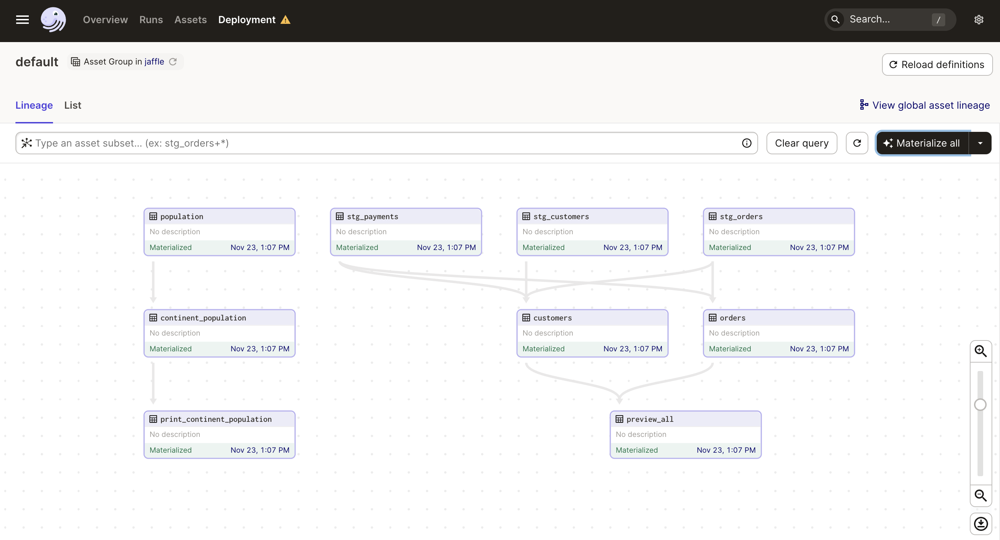
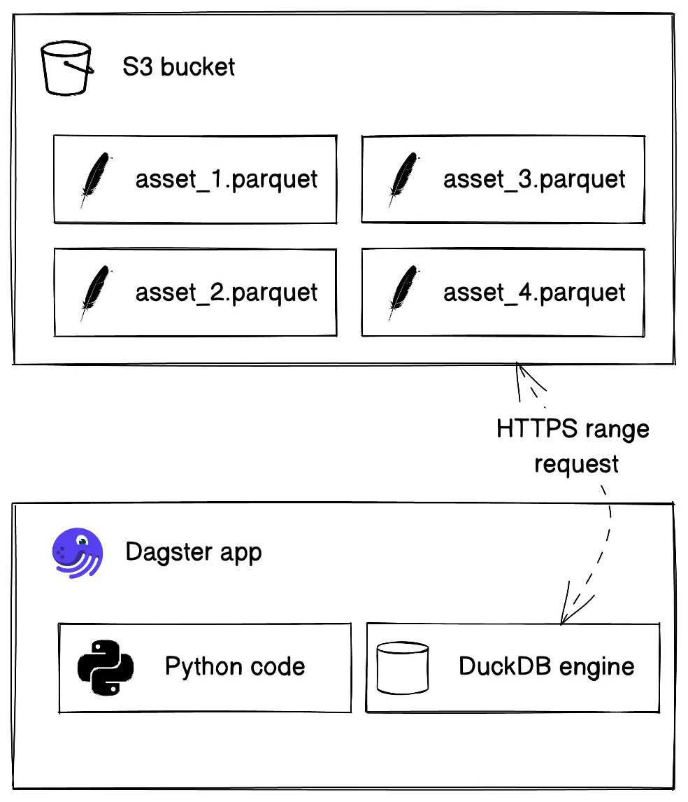

# jaffle

This is a [Dagster](https://dagster.io/) project scaffolded with [`dagster project scaffold`](https://docs.dagster.io/getting-started/create-new-project).

## Getting started

```bash
./install-deps.sh
```

Then, start the Dagit web server:

```bash
dagit
```

Open http://localhost:3000 with your browser to see the project.

You can start writing assets in `jaffle/assets/`. The assets are automatically loaded into the Dagster repository as you define them.



The assets can automatically track the data lineage by its reference function name.

## Architecture



## Playing around

1. Start the local S3 service by `localstack start`.
2. Create the S3 bucket by `awslocal s3 mb s3://datalake`.
3. List all the S3 buckets by `awslocal s3 ls`:
```bash
2023-11-23 13:06:50 datalake
```
4. Click "Materialize all" in Dagster UI.
5. Verify the result by `awslocal s3 ls s3://datalake`:
```bash
2023-11-23 13:07:16        406 continent_population.parquet
2023-11-23 13:07:16       3642 customers.parquet
2023-11-23 13:07:16       3896 orders.parquet
2023-11-23 13:07:13       8211 population.parquet
2023-11-23 13:07:13       2116 stg_customers.parquet
2023-11-23 13:07:13       2398 stg_orders.parquet
2023-11-23 13:07:13       2531 stg_payments.parquet
```
6. Copy the Parquet file out by `awslocal s3 cp s3://datalake/orders.parquet ./data`.
7. View the result by `python -c "import pandas as pd; print(pd.read_parquet('./data/orders.parquet'))"`:
```bash
    order_id  customer_id  order_date     status  credit_card_amount  coupon_amount  bank_transfer_amount  gift_card_amount  amount
0          1            1  2018-01-01   returned                10.0            0.0                   0.0               0.0    10.0
1          2            3  2018-01-02  completed                20.0            0.0                   0.0               0.0    20.0
2          3           94  2018-01-04  completed                 0.0            1.0                   0.0               0.0     1.0
3          4           50  2018-01-05  completed                 0.0           25.0                   0.0               0.0    25.0
4          5           64  2018-01-05  completed                 0.0            0.0                  17.0               0.0    17.0
..       ...          ...         ...        ...                 ...            ...                   ...               ...     ...
94        98           41  2018-04-07     placed                 0.0            0.0                  10.0               0.0    10.0
95        99           85  2018-04-09     placed                24.0            0.0                   0.0               0.0    24.0
96        44           66  2018-02-17  completed                 0.0            0.0                   0.0              11.0    11.0
97        50           51  2018-02-23  completed                26.0            0.0                   0.0               0.0    26.0
98        79           52  2018-03-23    shipped                27.0            0.0                   0.0               0.0    27.0

[99 rows x 9 columns]
```

## Development

### Adding new Python dependencies

You can specify new Python dependencies in `setup.py`.

### Unit testing

Tests are in the `jaffle_tests` directory and you can run tests using `pytest`:

```bash
pytest jaffle_tests
```

### Schedules and sensors

If you want to enable Dagster [Schedules](https://docs.dagster.io/concepts/partitions-schedules-sensors/schedules) or [Sensors](https://docs.dagster.io/concepts/partitions-schedules-sensors/sensors) for your jobs, start the [Dagster Daemon](https://docs.dagster.io/deployment/dagster-daemon) process in the same folder as your `workspace.yaml` file, but in a different shell or terminal.

The `$DAGSTER_HOME` environment variable must be set to a directory for the daemon to work. Note: using directories within /tmp may cause issues. See [Dagster Instance default local behavior](https://docs.dagster.io/deployment/dagster-instance#default-local-behavior) for more details.

```bash
dagster-daemon run
```

Once your Dagster Daemon is running, you can start turning on schedules and sensors for your jobs.

## Deploy on Dagster Cloud

The easiest way to deploy your Dagster project is to use Dagster Cloud.

Check out the [Dagster Cloud Documentation](https://docs.dagster.cloud) to learn more.

## References

- https://dagster.io/blog/duckdb-data-lake
